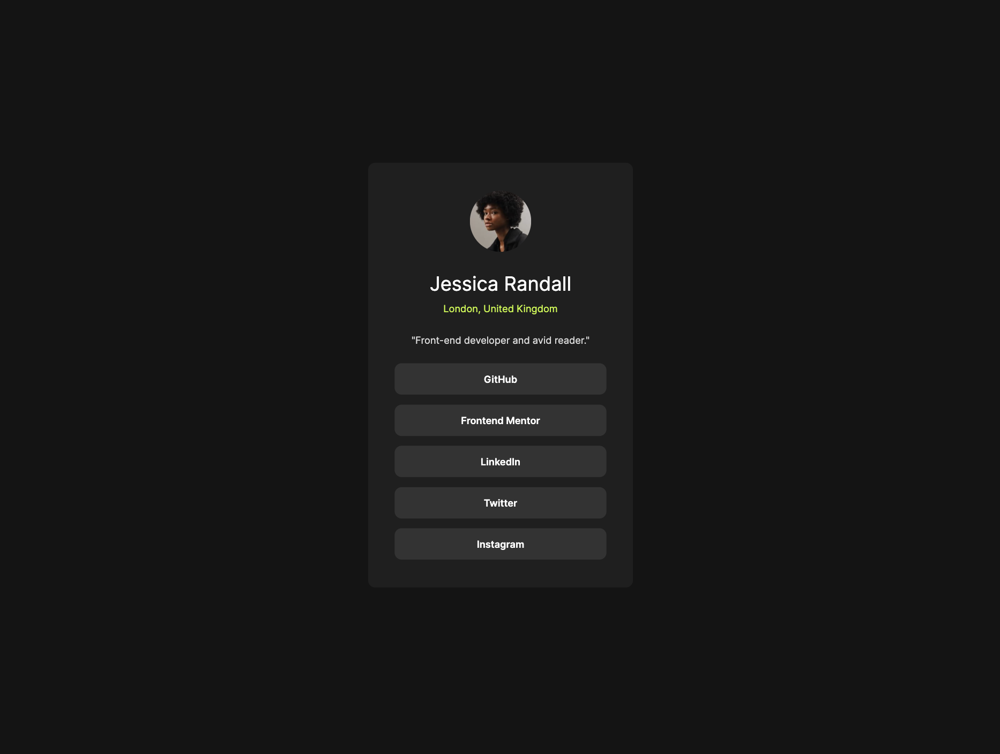
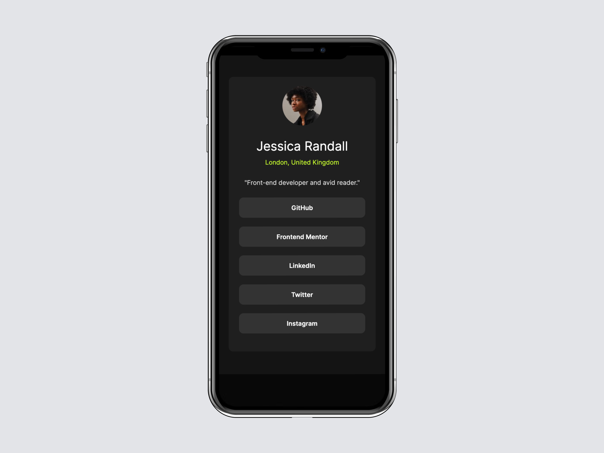

# Frontend Mentor - Social links profile solution

This is a solution to the [Social links profile challenge on Frontend Mentor](https://www.frontendmentor.io/challenges/social-links-profile-UG32l9m6dQ). Frontend Mentor challenges help you improve your coding skills by building realistic projects. 

## Table of contents

- [Overview](#overview)
  - [The challenge](#the-challenge)
  - [Screenshot](#screenshot)
  - [Links](#links)
- [My process](#my-process)
  - [Built with](#built-with)
  - [What I learned](#what-i-learned)
  - [Continued development](#continued-development)
- [Author](#author)
- [Acknowledgments](#acknowledgments)

## Overview

### The challenge

Users should be able to:

- See hover and focus states for all interactive elements on the page

### Screenshot

### Links

- Solution URL: [GitHub](https://github.com/svetikbaihe/profile.git)
- Live Site URL: [Vercel](https://profile-zeta-coral.vercel.app/)

## My process

### Built with

- HTML5 markup
- SCSS/SASS
- Flexbox
- OOP
- Vite

### What I learned

This was my first project deployed on Vercel if I am not mistaken. There were some obstacles while doing this, however I've managed to deal with them eventually.

Maybe the following info would be useful for someone (and that's what I'll do next time). If you deploy your project with Vercel, you need to place your static assets, in my case images, into a public folder and remove 'public' in the img path. Live and learn.

### Continued development

It was pretty difficult for me to deal with the links' section, I got a little help with writing the objects in array, frankly speaking. So yeah, OOP is definitely still confusing and I'm still learning how to work with it.

## Author

- Frontend Mentor -
  [@svetikbaihe](https://www.frontendmentor.io/profile/svetikbaihe)

## Acknowledgments

- Kudos to my mentor - [@ArtemPapusha](https://github.com/ArtemPapusha)
